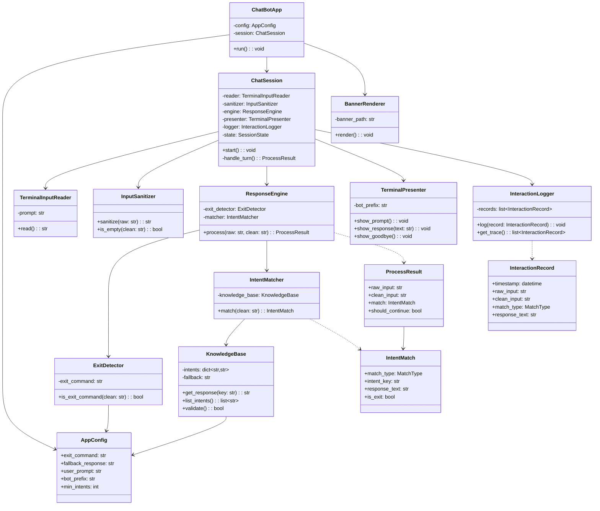
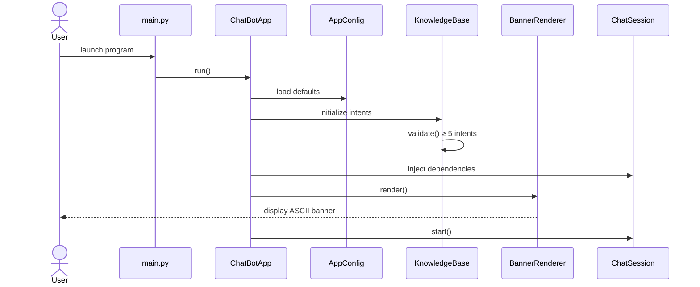
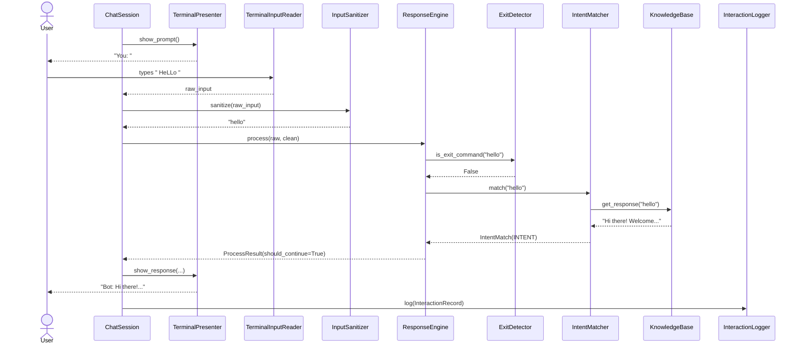
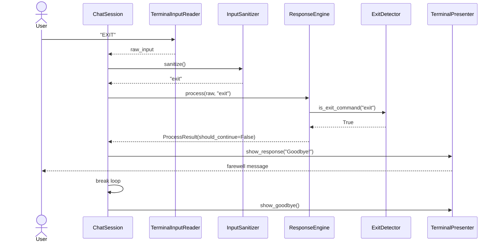

# Rule-Based AI Chatbot — Solution Design

Design derived from `docs/requirements.md`. Maps to the **IPO model**, **dictionary-based intent matching**, and the five mandatory logic-skeleton requirements (input loop, sanitization, knowledge base, fallback, exit strategy).

---

## 1. Folder Structure

```
Project 1/
├── docs/
│   ├── requirements.md              # Specification analysis (existing)
│   └── architecture.md              # This design (recommended to save)
│
├── src/
│   ├── __init__.py
│   ├── main.py                      # Application entry point
│   │
│   ├── config/
│   │   ├── __init__.py
│   │   └── settings.py              # App constants & configuration
│   │
│   ├── core/
│   │   ├── __init__.py
│   │   ├── models.py                # Shared data structures (DTOs)
│   │   └── enums.py                 # Match types, session states
│   │
│   ├── knowledge/
│   │   ├── __init__.py
│   │   └── knowledge_base.py        # Intent dictionary & metadata
│   │
│   ├── input/
│   │   ├── __init__.py
│   │   ├── reader.py                # Terminal input acquisition
│   │   └── sanitizer.py             # Normalization pipeline
│   │
│   ├── process/
│   │   ├── __init__.py
│   │   ├── exit_detector.py         # Exit command detection
│   │   ├── intent_matcher.py        # O(1) dictionary lookup
│   │   └── response_engine.py       # Process-stage orchestration
│   │
│   ├── output/
│   │   ├── __init__.py
│   │   ├── presenter.py             # Response & prompt rendering
│   │   └── banner.py                # Startup banner / branding
│   │
│   └── session/
│       ├── __init__.py
│       ├── chat_session.py          # Infinite loop controller
│       └── interaction_logger.py    # Optional traceability log
│
├── tests/
│   ├── __init__.py
│   ├── test_sanitizer.py
│   ├── test_knowledge_base.py
│   ├── test_intent_matcher.py
│   ├── test_exit_detector.py
│   ├── test_response_engine.py
│   └── test_chat_session.py
│
├── assets/
│   └── banner.txt                   # ASCII art / welcome text
│
├── README.md                        # Setup, usage, design overview
└── pyproject.toml                   # Project metadata (optional)
```

**Design rationale:** Each top-level package under `src/` maps to one IPO stage or cross-cutting concern. That keeps the white-box traceability the spec requires: Input → Process → Output, with knowledge and session as supporting layers.

---

## 2. Components

| Component | Layer | Purpose |
|-----------|-------|---------|
| **ChatBotApp** | Application | Bootstraps dependencies, starts and stops the system |
| **AppConfig** | Configuration | Centralizes exit command, fallback text, prompt labels |
| **KnowledgeBase** | Knowledge | Stores ≥5 intent→response mappings |
| **TerminalInputReader** | Input | Reads raw user text from the terminal |
| **InputSanitizer** | Input | Lowercases and strips whitespace (extensible pipeline) |
| **ExitDetector** | Process | Determines whether sanitized input is an exit command |
| **IntentMatcher** | Process | Performs O(1) intent lookup via dictionary `.get()` |
| **ResponseEngine** | Process | Combines match result into a structured process output |
| **TerminalPresenter** | Output | Displays prompts, bot replies, and shutdown messages |
| **BannerRenderer** | Output | Shows startup branding / welcome screen |
| **ChatSession** | Session | Owns the continuous `while` loop lifecycle |
| **InteractionLogger** | Session | Records Input → Logic → Output for explainability (optional) |
| **ProcessResult / IntentMatch** | Core | Typed carriers for data moving between stages |

---

## 3. Modules

| Module | Path | Exports | Depends On |
|--------|------|---------|------------|
| `config.settings` | `src/config/settings.py` | `AppConfig` | — |
| `core.models` | `src/core/models.py` | `IntentMatch`, `ProcessResult`, `InteractionRecord` | `core.enums` |
| `core.enums` | `src/core/enums.py` | `MatchType`, `SessionState` | — |
| `knowledge.knowledge_base` | `src/knowledge/knowledge_base.py` | `KnowledgeBase` | `config.settings` |
| `input.reader` | `src/input/reader.py` | `TerminalInputReader` | — |
| `input.sanitizer` | `src/input/sanitizer.py` | `InputSanitizer` | — |
| `process.exit_detector` | `src/process/exit_detector.py` | `ExitDetector` | `config.settings` |
| `process.intent_matcher` | `src/process/intent_matcher.py` | `IntentMatcher` | `knowledge.knowledge_base`, `core.models` |
| `process.response_engine` | `src/process/response_engine.py` | `ResponseEngine` | `process.intent_matcher`, `process.exit_detector`, `core.models` |
| `output.presenter` | `src/output/presenter.py` | `TerminalPresenter` | — |
| `output.banner` | `src/output/banner.py` | `BannerRenderer` | `assets/banner.txt` |
| `session.chat_session` | `src/session/chat_session.py` | `ChatSession` | input, process, output modules |
| `session.interaction_logger` | `src/session/interaction_logger.py` | `InteractionLogger` | `core.models` |
| `main` | `src/main.py` | `main()` | all above |

---

## 4. Classes

### 4.1 Application Layer

#### `ChatBotApp`
| Attribute / Method | Description |
|--------------------|-------------|
| `config: AppConfig` | Runtime configuration |
| `session: ChatSession` | Loop controller |
| `run()` | Initialize components, render banner, start session |

---

### 4.2 Configuration Layer

#### `AppConfig`
| Attribute | Default | Description |
|-----------|---------|-------------|
| `exit_command: str` | `"exit"` | Keyword that terminates the loop |
| `fallback_response: str` | `"I do not understand."` | Default reply for unknown intents |
| `user_prompt: str` | `"You: "` | Terminal input label |
| `bot_prefix: str` | `"Bot: "` | Terminal output label |
| `min_intents: int` | `5` | Minimum required knowledge-base size |

---

### 4.3 Core Models

#### `MatchType` (enum)
- `EXIT`
- `INTENT`
- `FALLBACK`

#### `IntentMatch`
| Field | Type | Description |
|-------|------|-------------|
| `match_type` | `MatchType` | How the input was classified |
| `intent_key` | `str \| None` | Matched dictionary key (if any) |
| `response_text` | `str` | Final reply to display |
| `is_exit` | `bool` | Whether session should terminate |

#### `ProcessResult`
| Field | Type | Description |
|-------|------|-------------|
| `raw_input` | `str` | Original user text |
| `clean_input` | `str` | Sanitized text |
| `match` | `IntentMatch` | Classification + response |
| `should_continue` | `bool` | Inverse of exit signal |

#### `InteractionRecord` (optional logging)
| Field | Type | Description |
|-------|------|-------------|
| `timestamp` | `datetime` | When interaction occurred |
| `raw_input` | `str` | Input stage |
| `clean_input` | `str` | Post-sanitization |
| `match_type` | `MatchType` | Process stage |
| `response_text` | `str` | Output stage |

---

### 4.4 Knowledge Layer

#### `KnowledgeBase`
| Attribute / Method | Description |
|--------------------|-------------|
| `_intents: dict[str, str]` | Intent key → response text |
| `fallback: str` | Default response |
| `get_response(key: str) -> str` | Atomic lookup + fallback via `.get()` |
| `list_intents() -> list[str]` | Returns all registered keys |
| `validate() -> bool` | Ensures ≥ `min_intents` entries |

**Seed intents (minimum 5):**

| Intent Key | Response |
|------------|----------|
| `hello` | `"Hi there! Welcome to the Logic Engine."` |
| `hi` | `"Hello! How can I help you today?"` |
| `help` | `"Supported commands: hello, hi, help, bye, exit."` |
| `bye` | `"Goodbye! Have a great day."` |
| `how are you` | `"I'm running on deterministic logic — always consistent!"` |

> `exit` is handled by `ExitDetector`, not the knowledge base, to satisfy FR-5 cleanly.

---

### 4.5 Input Layer

#### `TerminalInputReader`
| Method | Description |
|--------|-------------|
| `read() -> str` | Blocks on `input(prompt)` and returns raw string |

#### `InputSanitizer`
| Method | Description |
|--------|-------------|
| `sanitize(raw: str) -> str` | Applies `strip()` then `lower()` |
| `is_empty(clean: str) -> bool` | Detects whitespace-only input |

---

### 4.6 Process Layer

#### `ExitDetector`
| Method | Description |
|--------|-------------|
| `is_exit_command(clean_input: str) -> bool` | Compares against `config.exit_command` |

#### `IntentMatcher`
| Method | Description |
|--------|-------------|
| `match(clean_input: str) -> IntentMatch` | Uses `knowledge_base.get_response()`; sets `MatchType.INTENT` or `FALLBACK` |

#### `ResponseEngine`
| Method | Description |
|--------|-------------|
| `process(raw: str, clean: str) -> ProcessResult` | Orchestrates exit check → intent match → result assembly |

**Processing order (deterministic):**
1. If exit → return `MatchType.EXIT`, `should_continue=False`
2. Else if intent found → return `MatchType.INTENT`
3. Else → return `MatchType.FALLBACK`

---

### 4.7 Output Layer

#### `TerminalPresenter`
| Method | Description |
|--------|-------------|
| `show_prompt()` | Displays user input label |
| `show_response(text: str)` | Displays bot reply |
| `show_goodbye()` | Displays shutdown message |
| `show_error(message: str)` | Displays non-fatal errors (future) |

#### `BannerRenderer`
| Method | Description |
|--------|-------------|
| `render()` | Loads and prints ASCII banner from `assets/banner.txt` |

---

### 4.8 Session Layer

#### `ChatSession`
| Attribute / Method | Description |
|--------------------|-------------|
| `reader`, `sanitizer`, `engine`, `presenter`, `logger` | Injected dependencies |
| `state: SessionState` | `RUNNING` / `STOPPED` |
| `start()` | Runs the infinite loop until exit |
| `_handle_turn()` | One IPO cycle per iteration |

#### `InteractionLogger`
| Method | Description |
|--------|-------------|
| `log(record: InteractionRecord)` | Writes trace line to stdout or file |
| `get_trace() -> list[InteractionRecord]` | Returns session history (testing/debug) |

---

## 5. Responsibilities

| Requirement | Responsible Component |
|-------------|---------------------|
| FR-1 Input loop | `ChatSession.start()` |
| FR-2 Sanitization | `InputSanitizer.sanitize()` |
| FR-3 Knowledge base (≥5 intents) | `KnowledgeBase` |
| FR-4 Fallback | `KnowledgeBase.get_response()` + `IntentMatcher` |
| FR-5 Exit strategy | `ExitDetector` + `ChatSession` break logic |
| FR-6 Greetings | `KnowledgeBase` (`hello`, `hi`) |
| FR-7 Exit commands | `ExitDetector` |
| FR-8 Conditional logic | `ResponseEngine.process()` |
| FR-9 Continuous loop | `ChatSession` |
| FR-10 Dictionary lookup | `KnowledgeBase.get_response()` |
| FR-11 Atomic `.get()` | `KnowledgeBase.get_response(key, fallback)` |
| FR-12 IPO model | Module separation: `input/` → `process/` → `output/` |
| NFR-1 Determinism | No randomness; fixed dictionary |
| NFR-2 Explainability | `InteractionLogger` + typed `ProcessResult` |
| NFR-5 O(1) lookup | Dictionary, not if-elif ladder |
| NFR-6 Maintainability | One class per concern, dependency injection |

**Single-responsibility rule:** No class both reads input and matches intents. `ChatSession` orchestrates only; it does not contain business rules.

---

## 6. Data Flow

```
┌─────────────┐
│    USER     │
└──────┬──────┘
       │ raw text ("  HeLLo  ")
       ▼
┌─────────────────────┐
│ TerminalInputReader │  INPUT STAGE
└──────────┬──────────┘
           │ raw: "  HeLLo  "
           ▼
┌─────────────────────┐
│   InputSanitizer    │
└──────────┬──────────┘
           │ clean: "hello"
           ▼
┌─────────────────────┐
│  ResponseEngine     │  PROCESS STAGE
│  ├─ ExitDetector    │──► exit? ──yes──► ProcessResult(is_exit=True)
│  └─ IntentMatcher   │
│       └─ KnowledgeBase.get("hello") ──► "Hi there!..."
└──────────┬──────────┘
           │ ProcessResult
           ▼
┌─────────────────────┐
│ TerminalPresenter   │  OUTPUT STAGE
└──────────┬──────────┘
           │ displayed response
           ▼
┌─────────────────────┐
│ InteractionLogger   │  (optional trace)
└──────────┬──────────┘
           │
           ▼
       back to USER
       (loop continues unless exit)
```

### Data artifacts per turn

| Stage | Input | Output |
|-------|-------|--------|
| Read | prompt string | `raw_input: str` |
| Sanitize | `raw_input` | `clean_input: str` |
| Process | `raw_input`, `clean_input` | `ProcessResult` |
| Present | `ProcessResult.response_text` | terminal output |
| Log | `ProcessResult` | `InteractionRecord` |

---

## 7. Execution Flow

```
START
  │
  ├─► Load AppConfig
  ├─► Build KnowledgeBase (validate ≥5 intents)
  ├─► Wire dependencies (reader, sanitizer, engine, presenter, logger)
  ├─► Render BannerRenderer
  │
  ▼
┌──────────────────────────────────────┐
│         ChatSession.start()          │
│                                      │
│  WHILE state == RUNNING:             │
│    │                                 │
│    ├─► presenter.show_prompt()       │
│    ├─► raw = reader.read()           │
│    ├─► clean = sanitizer.sanitize()  │
│    │                                 │
│    ├─► result = engine.process(      │
│    │         raw, clean)             │
│    │                                 │
│    ├─► presenter.show_response(      │
│    │         result.match.response)  │
│    ├─► logger.log(record)           │
│    │                                 │
│    ├─► IF NOT result.should_continue:│
│    │       BREAK                     │
│    └─► LOOP                          │
└──────────────────────────────────────┘
  │
  ├─► presenter.show_goodbye()
  └─► END
```

### Turn-level decision table

| Sanitized Input | ExitDetector | IntentMatcher | Action |
|-----------------|--------------|---------------|--------|
| `"exit"` | `True` | skipped | Show exit message → break loop |
| `"hello"` | `False` | match found | Show intent response → continue |
| `"asdfgh"` | `False` | no match | Show fallback → continue |
| `""` | `False` | no match | Show fallback → continue |
| `"EXIT"` | `True` | skipped | Exit (sanitized to `"exit"`) |

---

## 8. UML Diagram



---

## 9. Sequence Diagram

### 9.1 Application startup



### 9.2 Single conversation turn (happy path)



### 9.3 Exit turn



---

## 10. Future Scalability Options

### 10.1 Knowledge base expansion

| Option | Description | Benefit |
|--------|-------------|---------|
| **Externalized intents** | Load intents from JSON/YAML instead of hard-coded dict | Non-developers can update responses |
| **Intent aliases** | Map multiple keys → one response (`{"hi","hello"} → same reply`) | Better UX without duplicating values |
| **Intent categories** | Group intents by domain (greeting, help, FAQ) | Easier maintenance at scale |
| **Versioned knowledge** | Track KB versions for audit/compliance | Finance/healthcare guardrail readiness |

### 10.2 Matching intelligence (still deterministic)

| Option | Description | Benefit |
|--------|-------------|---------|
| **Sanitization pipeline** | Chain strip → lower → remove punctuation | Handles `"hello!"` edge case |
| **Keyword-in-phrase rules** | Token-based or prefix rules for partial matches | Supports `"hello there"` without ML |
| **Priority rules** | Rule precedence before dictionary lookup | Nested conditions from spec extensions |
| **Trie / Aho-Corasick** | Multi-pattern matching at scale | O(n) text scan vs O(1) single key |

### 10.3 Architecture evolution

| Option | Description | Benefit |
|--------|-------------|---------|
| **Strategy pattern for matchers** | Pluggable `ExactMatcher`, `FuzzyMatcher`, `RegexMatcher` | Swap algorithms without changing session |
| **Hybrid router** | Rule match → instant response; no match → LLM (Project N+) | Aligns with spec’s guardrails + LLM diagram |
| **Plugin intents** | Register intents via entry points | Third-party extensions |
| **State machine sessions** | Track conversation context across turns | Multi-turn dialogs |
| **Repository interface** | `IKnowledgeRepository` abstraction | Swap in-memory, file, or DB backends |

### 10.4 Interface & deployment

| Option | Description | Benefit |
|--------|-------------|---------|
| **Adapter pattern for I/O** | `WebInputReader`, `CLIInputReader` | Reuse process layer in API/web chat |
| **REST/WebSocket API** | Wrap `ChatSession` behind HTTP | Production chatbot backend |
| **Structured logging** | JSON logs with correlation IDs | Observability at scale |
| **Metrics export** | Count intents, fallbacks, exits | Monitor bot effectiveness |

### 10.5 Quality & compliance

| Option | Description | Benefit |
|--------|-------------|---------|
| **Explainability API** | Return matched rule + reason for each reply | White-box audit trail |
| **Input validation layer** | Max length, block control chars | Hardening against abuse |
| **Content filtering guardrails** | Block/redact sensitive patterns pre-response | NVIDIA NeMo / Llama Guard pattern |
| **i18n layer** | Locale-specific knowledge bases | Multi-language support |

### 10.6 Recommended evolution path

```
Phase 1 (current)     Exact dictionary + IPO loop + terminal
        ↓
Phase 2               External JSON KB + sanitization pipeline + tests
        ↓
Phase 3               Alias map + logging + explainability trace
        ↓
Phase 4               Hybrid router (rules first, LLM fallback)
        ↓
Phase 5               API layer + guardrails + persistent session state
```

---

## Design Summary

| Concern | Design choice |
|---------|---------------|
| Architecture pattern | Layered IPO + session orchestration |
| Intent storage | In-memory `dict` with `.get()` fallback |
| Loop ownership | `ChatSession` (single place for `while True`) |
| Exit handling | Dedicated `ExitDetector` (separate from intent KB) |
| Extensibility | Dependency injection; modules swappable without changing loop |
| Verification alignment | Every FR/NFR maps to a named class and test file |

This design satisfies all mandatory requirements in `docs/requirements.md` without implementing code. It is ready to implement module-by-module starting from `core.models` → `knowledge` → `input` → `process` → `output` → `session` → `main`.

If you want this saved to the repo, I can write it to `docs/architecture.md`.