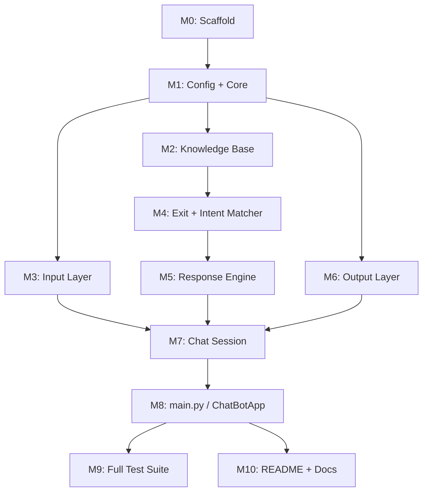

# Implementation Roadmap

Implementation plan for the Rule-Based AI Chatbot, derived from `docs/design.md` and `docs/requirements.md`.

Build order follows the design recommendation: **foundation → knowledge → input → process → output → session → application**, with tests co-located per layer.

---

## Milestone 0 — Project scaffold

**Goal**  
Create the folder layout, package entry points, and minimal project metadata so later modules have a stable home.

**Files affected**
- `src/__init__.py`
- `src/config/__init__.py`
- `src/core/__init__.py`
- `src/knowledge/__init__.py`
- `src/input/__init__.py`
- `src/process/__init__.py`
- `src/output/__init__.py`
- `src/session/__init__.py`
- `tests/__init__.py`
- `assets/` (empty or placeholder)
- `pyproject.toml` (optional but recommended)
- `README.md` (stub)

**Dependencies**  
None.

**Acceptance criteria**
- All packages import without error (`python -c "import src"` or equivalent).
- Directory structure matches the design in Section 1 of `docs/design.md`.
- A single documented command exists to run the app once `main.py` exists.

---

## Milestone 1 — Configuration & core data models

**Goal**  
Centralize runtime constants and define the typed carriers (`IntentMatch`, `ProcessResult`, `InteractionRecord`) that flow through the IPO pipeline.

**Files affected**
- `src/config/settings.py` — `AppConfig`
- `src/core/enums.py` — `MatchType`, `SessionState`
- `src/core/models.py` — `IntentMatch`, `ProcessResult`, `InteractionRecord`

**Dependencies**  
Milestone 0.

**Acceptance criteria**
- `AppConfig` exposes defaults: `exit_command`, `fallback_response`, `user_prompt`, `bot_prefix`, `min_intents=5`.
- `MatchType` includes `EXIT`, `INTENT`, `FALLBACK`.
- `IntentMatch` and `ProcessResult` can be constructed with the fields defined in design Section 4.3.
- No business logic yet — only data structures and config.

---

## Milestone 2 — Knowledge base

**Goal**  
Implement the intent dictionary with O(1) lookup, fallback via `.get()`, and validation for the ≥5 intent requirement (FR-3, FR-4, FR-10, FR-11).

**Files affected**
- `src/knowledge/knowledge_base.py` — `KnowledgeBase`
- `tests/test_knowledge_base.py`

**Dependencies**  
Milestone 1 (`AppConfig` for `min_intents` and `fallback_response`).

**Acceptance criteria**
- At least 5 seed intents exist (`hello`, `hi`, `help`, `bye`, `how are you` per design).
- `get_response("hello")` returns the mapped reply; `get_response("unknown")` returns fallback.
- `validate()` returns `True` when intent count ≥ `min_intents`, `False` otherwise.
- `list_intents()` returns all registered keys.
- `exit` is **not** stored as a normal intent (handled separately by `ExitDetector`).
- Unit tests cover: known match, fallback, validation pass/fail.

---

## Milestone 3 — Input layer

**Goal**  
Acquire raw terminal input and normalize it before matching (FR-2).

**Files affected**
- `src/input/reader.py` — `TerminalInputReader`
- `src/input/sanitizer.py` — `InputSanitizer`
- `tests/test_sanitizer.py`

**Dependencies**  
Milestone 1 (`AppConfig.user_prompt` for the reader prompt).

**Acceptance criteria**
- `sanitize("  HeLLo  ")` → `"hello"`.
- `is_empty("")` and `is_empty("   ")` → `True`.
- Sanitizer does not crash on long input, special characters, or empty strings.
- `TerminalInputReader.read()` uses the configured prompt label.
- Unit tests cover case/whitespace normalization and empty-input detection.

---

## Milestone 4 — Process layer (exit + intent matching)

**Goal**  
Classify sanitized input as exit, matched intent, or fallback — without yet wiring the full session loop.

**Files affected**
- `src/process/exit_detector.py` — `ExitDetector`
- `src/process/intent_matcher.py` — `IntentMatcher`
- `tests/test_exit_detector.py`
- `tests/test_intent_matcher.py`

**Dependencies**  
Milestones 1–2 (`AppConfig`, `KnowledgeBase`, core models).

**Acceptance criteria**
- `ExitDetector.is_exit_command("exit")` → `True`; `"EXIT"` after sanitization → `True`; `"hello"` → `False`.
- `IntentMatcher.match("hello")` returns `MatchType.INTENT` with correct `intent_key` and `response_text`.
- Unknown input returns `MatchType.FALLBACK` with fallback text.
- `IntentMatcher` does not treat `exit` as a KB intent when exit is handled upstream (design separation).
- Unit tests cover exit detection, intent hit, and fallback paths.

---

## Milestone 5 — Process layer (response engine)

**Goal**  
Orchestrate the deterministic processing order: exit → intent → fallback (FR-8).

**Files affected**
- `src/process/response_engine.py` — `ResponseEngine`
- `tests/test_response_engine.py`

**Dependencies**  
Milestone 4 (`ExitDetector`, `IntentMatcher`, core models).

**Acceptance criteria**
- Processing order is fixed: (1) exit, (2) intent, (3) fallback.
- `process(raw, "exit")` returns `ProcessResult` with `should_continue=False`, `MatchType.EXIT`.
- `process(raw, "hello")` returns `should_continue=True`, `MatchType.INTENT`.
- `process(raw, "asdfgh")` returns `should_continue=True`, `MatchType.FALLBACK`.
- `ProcessResult` preserves both `raw_input` and `clean_input`.
- Unit tests mirror the turn-level decision table in design Section 7.

---

## Milestone 6 — Output layer

**Goal**  
Render prompts, bot replies, startup banner, and shutdown messages (NFR-8).

**Files affected**
- `src/output/presenter.py` — `TerminalPresenter`
- `src/output/banner.py` — `BannerRenderer`
- `assets/banner.txt`
- Manual smoke test only (or lightweight test if desired)

**Dependencies**  
Milestone 1 (`AppConfig` for `bot_prefix`, `user_prompt`).

**Acceptance criteria**
- `show_prompt()` prints the configured user label (e.g. `"You: "`).
- `show_response(text)` prints bot reply with prefix (e.g. `"Bot: ..."`).
- `show_goodbye()` prints a farewell on shutdown.
- `BannerRenderer.render()` loads and prints `assets/banner.txt` without crashing if file exists.
- Output is side-effect only (print to stdout) — no matching logic in this layer.

---

## Milestone 7 — Session orchestration

**Goal**  
Own the continuous `while` loop and one full IPO turn per iteration (FR-1, FR-9, FR-12).

**Files affected**
- `src/session/chat_session.py` — `ChatSession`
- `src/session/interaction_logger.py` — `InteractionLogger` (optional but in design)
- `tests/test_chat_session.py`

**Dependencies**  
Milestones 3, 5, 6 (input, engine, presenter); Milestone 1 for `InteractionRecord`.

**Acceptance criteria**
- `ChatSession.start()` runs until `ProcessResult.should_continue` is `False`.
- Each turn: prompt → read → sanitize → process → present → (log) → continue or break.
- On exit: loop breaks, then `show_goodbye()` is called.
- Empty/whitespace input does not crash; falls through to fallback.
- `InteractionLogger` records `InteractionRecord` per turn (if implemented).
- Session contains **no** intent-matching rules — orchestration only (single-responsibility rule).
- Tests use mocked reader/engine where needed to verify loop behavior without manual input.

---

## Milestone 8 — Application bootstrap & entry point

**Goal**  
Wire all dependencies via `ChatBotApp` and expose a runnable CLI entry point.

**Files affected**
- `src/main.py` — `ChatBotApp`, `main()`

**Dependencies**  
All prior milestones (0–7).

**Acceptance criteria**
- Startup sequence matches design Section 7: load config → build KB → validate → wire deps → render banner → start session.
- KB validation failure prevents session start (or fails fast with a clear message).
- Running `python -m src.main` (or documented equivalent) launches an interactive terminal session.
- Manual end-to-end check:
  - `hello` → greeting
  - unknown → `"I do not understand."`
  - `exit` → clean termination

---

## Milestone 9 — Test suite & verification readiness

**Goal**  
Ensure full automated coverage of the logic skeleton and edge cases from `requirements.md` Section 8.

**Files affected**
- All `tests/test_*.py` files (consolidate/gap-fill if tests were added incrementally)
- Optional: test fixtures or mocks shared across tests

**Dependencies**  
Milestone 8 (full system present).

**Acceptance criteria**
- All unit tests pass (`pytest` or project test runner).
- Edge cases covered: empty input, unknown input, case variants, exit with different casing.
- No test depends on live `input()` unless explicitly mocked.
- Functional checklist from requirements Section 9 passes:
  - Continuous loop, sanitization, ≥5 intents, greeting, exit, fallback, determinism.

---

## Milestone 10 — Documentation & submission polish

**Goal**  
Make the project evaluable: setup instructions, architecture overview, and design traceability.

**Files affected**
- `README.md`
- Optional: save design to `docs/architecture.md` (design recommends this)

**Dependencies**  
Milestone 8 (working app); Milestone 9 (tests passing).

**Acceptance criteria**
- README includes: install/run steps, example session transcript, module map (IPO layers).
- README references deterministic/rule-based design (not ML).
- Evaluator can clone, run, and verify behavior without reading source.
- Meets DecodeLabs verification / portfolio quality signals (NFR-7).

---

## Dependency overview

**Parallelizable work after M1:** M2 (knowledge), M3 (input), and M6 (output) can be built in parallel before M4–M5 (process) and M7 (session).

---

## Requirements traceability

| Milestone | Requirements addressed |
|-----------|------------------------|
| M2 | FR-3, FR-4, FR-10, FR-11 |
| M3 | FR-2 |
| M4–M5 | FR-5, FR-6, FR-7, FR-8 |
| M7 | FR-1, FR-9, FR-12, NFR-2 |
| M8 | Full IPO integration |
| M9 | NFR-1, NFR-4, NFR-5, evaluation checklist |
